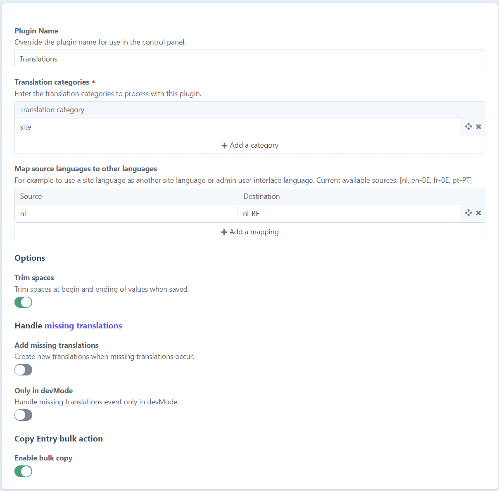
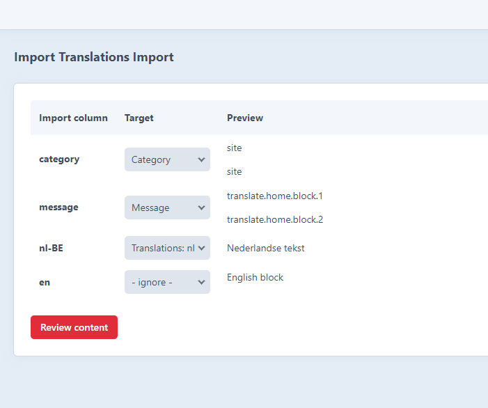

# Database Translations plugin for Craft CMS

Manage Craft i18n translations and store in database

## Requirements

This plugin requires Craft CMS 3.7 or later.

## Installation

To install the plugin, follow these instructions.

1. Open your terminal and go to your Craft project:

        cd /path/to/project

2. Then tell Composer to load the plugin:

        composer require digitalpulsebe/craft-database-translations

3. In the Control Panel, go to Settings → Plugins and click the “Install” button for Database Translations.

## Configuring Database Translations

Configure options in the Craft control panel or create a file in config/database-translations.php as a copy of [config.php](src/config.php).

### Configure the translation categories

Only the categories defined in the settings will be translated.

### Map languages

Do you need to use the same translated values for different languages
(for example different regions nl-BE and nl-NL)?
You can map one language to another.

This might also be useful to provide translations for admin user in the control panel.

### Trim spaces

Trim spaces at begin or ending of values when they are saved.

### Add missing translations

When a new unknown translation is used while rendering templates, an event is triggered.
Handling this event is optional. A new empty translation row will be added for the missing message.

### Copy Entry bulk action

Enable [this feature](#copy-entries-in-bulk-action)

## Importing translations

Apart from the automatic missing translations' event, there are four ways of adding
message rows in the database:

1. **Create one manually**

   Just enter the new message key and category to add an empty row

2. **Parse twig templates**

   Twig files are processed to find usage of the |t filter.
   The found results are listed in a review-step, select the rows you want to add to the database.

3. **Import CSV files**

   Import CSV files. Map the columns.

   

   The found results are listed in a review-step, select the rows you want to add to the database.

4. **Parse php translation files**

   The native translation files in ./translations folder can be mapped to database rows.
   The found results are listed in a review-step, select the rows you want to add to the database.
   You can even import files from plugins in the vendor folder.

   

## Exporting

1. Export all the rows using the export tab
2. Or, in the overview table, select the rows and languages to export
   - as csv file
   - as a content migration file

### Migration file export

The advantage of exporting to a migration file is that your content can be pushed to git and then the server when deploying. The migration file adds the rows to your database when `craft up` or `craft migrate/all` is executed.

## Manage translations

## Copy entries in bulk action

To enable this functionality both enable this in the settings 
and set the permission for the user ("Copy content bulk action").

You can now select Entries in the index table, and select the bulk action.
The content will be copied over to the other site in a queue job.

